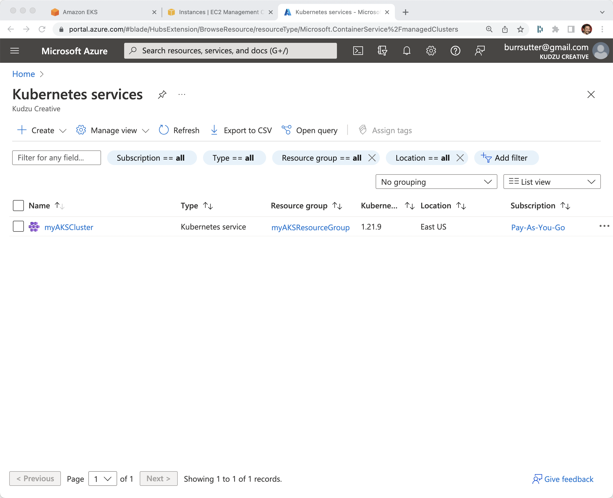

# AKS via Azure CLI

----

export KUBECONFIG=/Users/burr/xKS/.kubeconfig/aks1-config

az login

az group create --name myAKSResourceGroup --location eastus

az aks create --resource-group myAKSResourceGroup --name aks1 --node-count 2

----

----
az aks list --output table
Name          Location    ResourceGroup       KubernetesVersion    ProvisioningState    Fqdn
------------  ----------  ------------------  -------------------  -------------------  ----------------------------------------------------------------
myAKSCluster  eastus      myAKSResourceGroup  1.21.9               Succeeded            myaksclust-myaksresourcegro-75cfbc-3f29f234.hcp.eastus.azmk8s.io
----

[Azure Console]

----
export KUBECONFIG=/Users/burr/xKS/.kubeconfig/aks1-config
az aks get-credentials --resource-group myAKSResourceGroup --name aks1 --file $KUBECONFIG
----

----
kubectl get nodes
NAME                                STATUS   ROLES   AGE    VERSION
aks-nodepool1-36003093-vmss000000   Ready    agent   117s   v1.21.9
aks-nodepool1-36003093-vmss000001   Ready    agent   94s    v1.21.9
----

# Clean Up

----
az aks delete --resource-group myAKSResourceGroup --name myAKSCluster
----