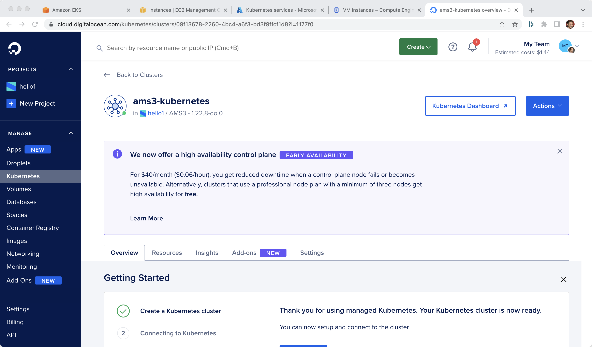

# DOKS via doctl

----
doctl auth init

doctl kubernetes cluster list

export KUBECONFIG=/Users/burr/xKS/.kubeconfig/doks1-config

doctl kubernetes cluster create ams3-kubernetes --region ams3 --node-pool="name=worker-pool;count=2"

----

----
kubectl cluster-info
Kubernetes control plane is running at https://09f13678-2260-4bc4-a6f3-bd3f9ffcf1d8.k8s.ondigitalocean.com
CoreDNS is running at https://09f13678-2260-4bc4-a6f3-bd3f9ffcf1d8.k8s.ondigitalocean.com/api/v1/namespaces/kube-system/services/kube-dns:dns/proxy
----

----
kubectl get nodes
NAME                STATUS   ROLES    AGE     VERSION
worker-pool-cmah4   Ready    <none>   5m10s   v1.22.8
worker-pool-cmahi   Ready    <none>   4m51s   v1.22.8
----

[Digital Ocean Console]

# Clean up
----
doctl k8s cluster delete ams3-kubernetes
----