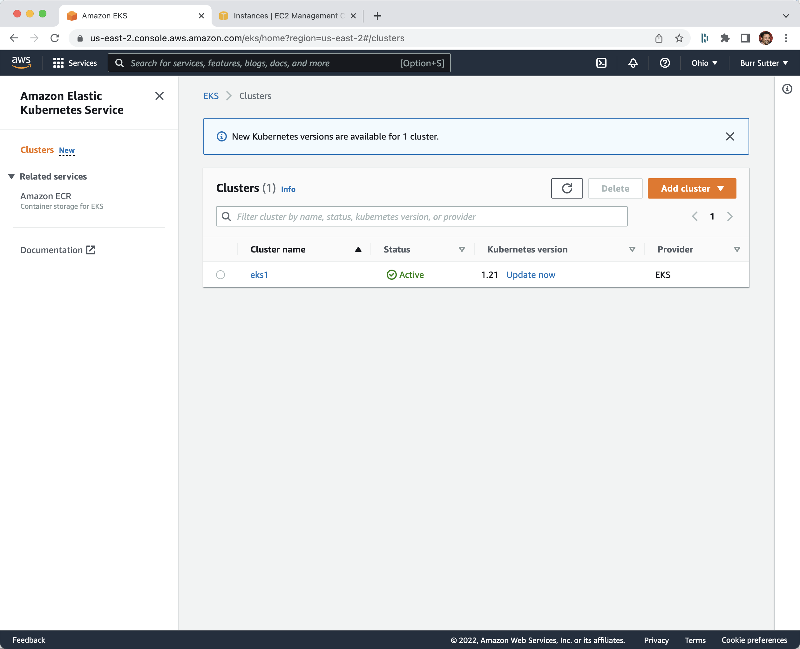
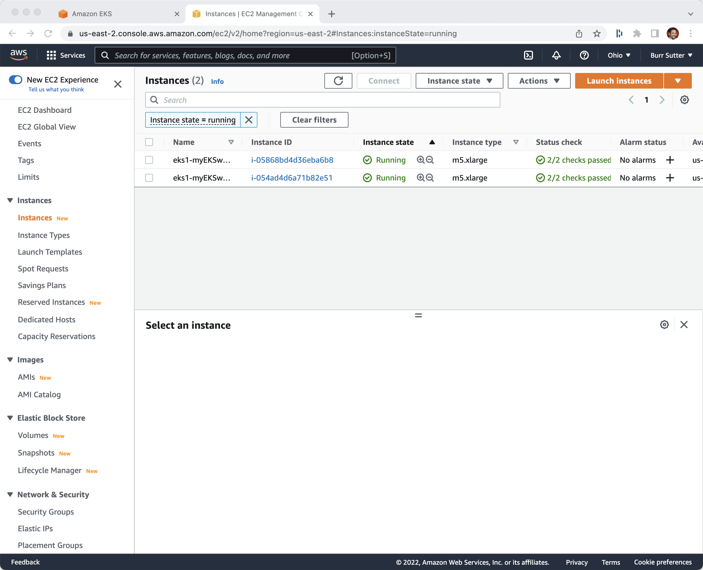

# EKS via eksctl CLI

AWS CLI

https://docs.aws.amazon.com/cli/latest/userguide/getting-started-install.html

This post discusses how to create an AWS IAM User that gives you the needed access key + secret needed to work with the AWS CLI

https://adamtheautomator.com/aws-eks-cli/

Download eksctl 

https://github.com/weaveworks/eksctl/releases

----
aws --version
# aws-cli/2.5.3 Python/3.9.12 Darwin/21.4.0 source/arm64 prompt/off

eksctl version
# 0.92.0

# establish access key, secret, default region, output format 
aws configure 

export KUBECONFIG=/Users/burr/xKS/.kubeconfig/eks1-config

eksctl create cluster \
--name eks1 \
--region us-east-2 \
--nodegroup-name myEKSworkers \
--instance-types=m5.xlarge \
--nodes 2 \
--managed
----

[EKS Console]

----
eksctl utils write-kubeconfig --cluster=eks1
----

----
kubectl cluster-info
Kubernetes control plane is running at https://66A069942E5C39E351B169903ED855D1.yl4.us-east-2.eks.amazonaws.com
CoreDNS is running at https://66A069942E5C39E351B169903ED855D1.yl4.us-east-2.eks.amazonaws.com/api/v1/namespaces/kube-system/services/kube-dns:dns/proxy

----

----
kubectl get nodes
NAME                                          STATUS   ROLES    AGE    VERSION
ip-192-168-59-62.us-east-2.compute.internal   Ready    <none>   119s   v1.21.5-eks-9017834
ip-192-168-95-31.us-east-2.compute.internal   Ready    <none>   2m1s   v1.21.5-eks-9017834
----

[EC2 Console]

## Clean Up

----
eksctl delete cluster --name eks1 --region us-east-2
----