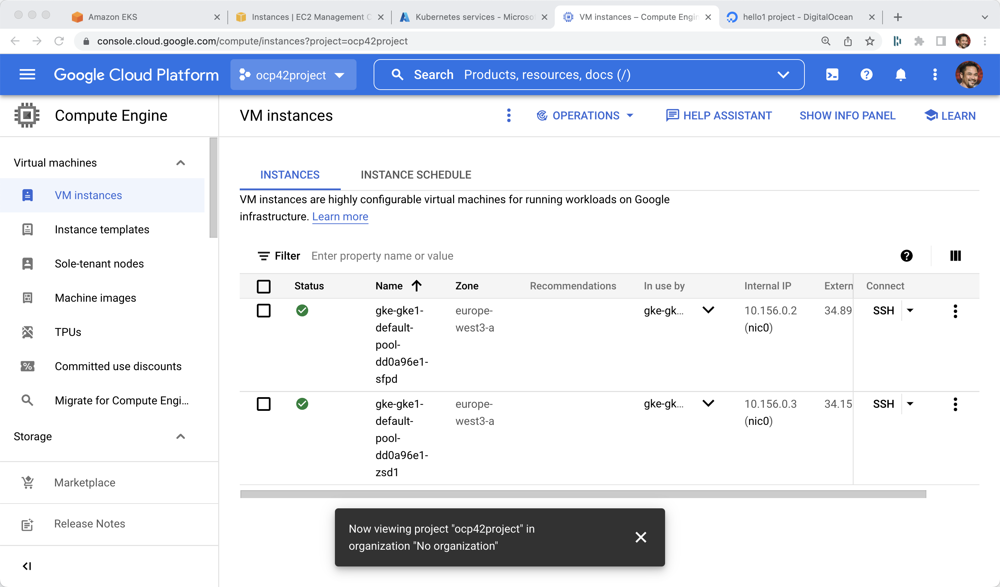

# GKE via gcloud CLI

----
gcloud container clusters list

export KUBECONFIG=/Users/burr/xKS/.kubeconfig/gke1-config

gcloud container clusters create gke1 --zone europe-west3-a --num-nodes 2

----

----
gcloud container clusters list
NAME  LOCATION        MASTER_VERSION   MASTER_IP       MACHINE_TYPE  NODE_VERSION     NUM_NODES  STATUS
gke1  europe-west3-a  1.21.6-gke.1503  35.246.140.169  e2-medium     1.21.6-gke.1503  2          RUNNING
----

[Google Cloud Console]

----

# or

gcloud container clusters create frankfurt --zone europe-west3-a --node-pool default-pool --num-nodes 2

gcloud container clusters describe frankfurt --zone europe-west3-a

gcloud container clusters get-credentials frankfurt --zone europe-west3-a

gcloud container clusters resize frankfurt --zone europe-west3-a --node-pool default-pool --num-nodes 2

kubectl apply -f mystuff/base/namespace.yaml
kubectl config set-context --current --namespace=mystuff
kubectl apply -f mystuff/base/deployment.yaml
kubectl apply -f mystuff/base/service.yaml

IP=$(kubectl get service myapp -o jsonpath="{.status.loadBalancer.ingress[0].ip}"):8080
echo $IP
curl $IP

while true
do curl $IP
sleep .3
done

gcloud container clusters delete frankfurt --zone europe-west3-a
----

# Clean Up

----
gcloud container clusters delete gke1 --zone europe-west3-a
----